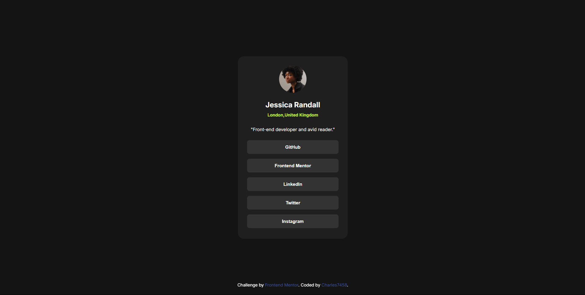

# Frontend Mentor - Social links profile solution

This is a solution to the [Social links profile challenge on Frontend Mentor](https://www.frontendmentor.io/challenges/social-links-profile-UG32l9m6dQ). Frontend Mentor challenges help you improve your coding skills by building realistic projects. 

## Table of contents

- [Overview](#overview)
  - [The challenge](#the-challenge)
  - [Screenshot](#screenshot)
  - [Links](#links)
  - [My process](#my-process)
  - [Built with](#built-with)
  - [What I learned](#what-i-learned)
  - [Continued development](#continued-development)
  - [Author](#author)

## Overview
  Build a social-links page.

### The challenge

Users should be able to:

- See hover and focus states for all interactive elements on the page

### Screenshot

### Links

- Live Site URL: (https://charles7458.github.io/social-links-page-solution)

## My process
    I wrote the raw html structure and then gave background-color to everything.
    Then I built the website from mobile-first approach, using rem measure for everything.
    I made the buttons as a list and edited its css.
    Finally I added the hover effects.
### Built with

- Semantic HTML5 markup
- CSS custom properties
- Flexbox
- CSS Grid
- Mobile-first workflow

### What I learned

This time instead of using separate button tags, I put them in a list. I tried this for the first time. It made it easier to edit.

### Continued development

To try to code faster and not take too long for each project. To learn JS and other frameworks.

## Author

- Frontend Mentor - [@Charles7458](https://www.frontendmentor.io/profile/Charles7458)

